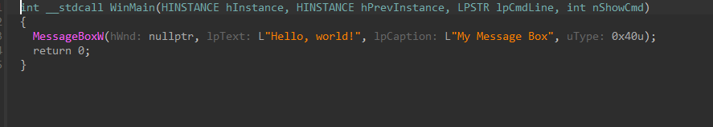
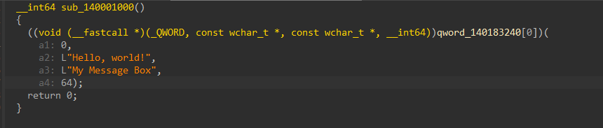

# credits

- deepseek - helped me actually understand the vmprotect source and write most of the unpack logic
- StormingMoon/VMProtectUnpacker - [inspired me & took some code from his base]
- callstack spoofer - https://github.com/Barracudach/CallStack-Spoofer/
- string encryption - https://github.com/JustasMasiulis/xorstr
- vmprotect 3.5.1 source - https://0xacab.org/bidasci/vmprotect-3.5.1

# notes

u might get flagged for debugger but it still dumps / unpacks from what i noticed.

also the import rebuilding is kinda scuffed sometimes, dumped exe might crash. brute-force scan doesnt always find all the iat slots. if u wanna fix it go ahead idk will look into it in the future.
note the project at this current state is not finished / got some issues i am working on fixing / resolving them!

# before



non packed pseudo
```c
int __stdcall WinMain(HINSTANCE hInstance, HINSTANCE hPrevInstance, LPSTR lpCmdLine, int nShowCmd)
{
  MessageBoxW(hWnd: nullptr, lpText: L"Hello, world!", lpCaption: L"My Message Box", uType: 0x40u);
  return 0;
}
```

# after



unpacked pseudo
```c
__int64 sub_140001000()
{
  ((void (__fastcall *)(_QWORD, const wchar_t *, const wchar_t *, __int64))qword_140183240[0])(
    a1: 0,
    a2: L"Hello, world!",
    a3: L"My Message Box",
    a4: 64);
  return 0;
}
```
